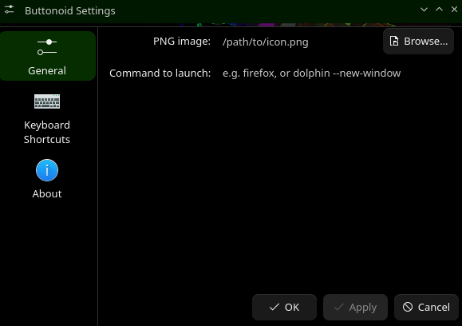

# buttonoid

A Plasma 6 configurable button widget that allows the user to set a transparent PNG to execute a Bash command on-click.




## Dependencies

Ensure `git` and KDE package management tools are installed:

```bash
# Arch / CachyOS / Manjaro
sudo pacman -S git kpackage plasma-sdk

# Fedora
sudo dnf install git kf6-kpackage plasma-sdk

# Debian / Ubuntu / KDE Neon
sudo apt install git kpackagetool6 plasma-sdk
```

## Installation

Run the following commands in your terminal:

```bash
git clone [https://github.com/wombatOfCombat/buttonoid.git](https://github.com/wombatOfCombat/buttonoid.git) ~/buttonoid
cd ~/buttonoid

# Install the widget
kpackagetool6 -t Plasma/Applet -i package

# Restart plasmashell so the widget appears in your widget list
systemctl --user restart plasma-plasmashell
```

## Update

To update an existing installation after pulling new changes:

```bash
cd ~/buttonoid
git pull
kpackagetool6 -t Plasma/Applet -u package
systemctl --user restart plasma-plasmashell
```

## Removal

To uninstall the widget:

```bash
kpackagetool6 -t Plasma/Applet -r buttonoid
```